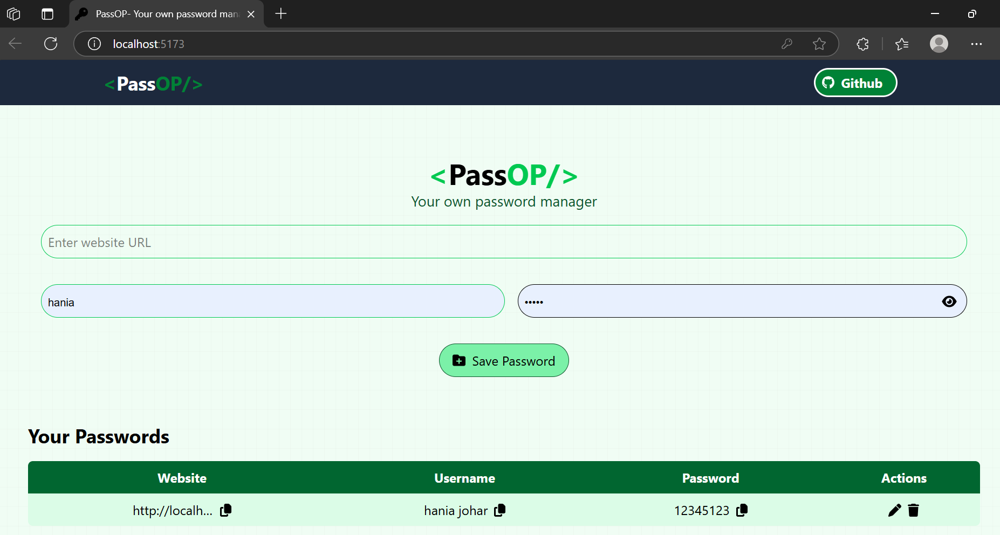

# 🔐 PassOP - Password Manager

PassOP is a simple, secure, and modern password manager built with Node.js and React. It allows users to store and manage their passwords safely in one place.

 <!-- Replace with an actual screenshot path -->

## 🚀 Features

- 🧠 Save passwords for multiple platforms (e.g., Facebook, Gmail, etc.)
- 🔒 Strong password suggestions
- 🗝️ Password encryption & decryption
- 🧹 Clean and responsive UI
- 📋 Copy password to clipboard
- 🗑️ Delete/update saved entries

## 🛠️ Tech Stack

- **Frontend**: React.js, TailwindCSS
- **Version Control**: Git + GitHub

## 📁 Folder Structure

```bash
PassOP/
├── node_modules/
├── public/
├── src/
│   ├── components/
│   ├── pages/
│   ├── App.jsx
│   └── main.jsx
├── .gitignore
├── package.json
├── vite.config.js
└── README.md
🚧 Setup Instructions
bash
Copy
Edit
# Clone the repo
git clone https://github.com/haniajohar/PassOP.git

# Navigate to the project
cd PassOP

# Install dependencies
npm install

# Run the development server
npm run dev
🙌 Contributing
Pull requests are welcome! For major changes, please open an issue first to discuss what you'd like to change.

📄 License
MIT License. See LICENSE for details.

🧑‍💻 Author
Made with 💙 by @haniajohar

yaml
Copy
Edit

---

Let me know if you'd like to include:

- Screenshots
- Demo video/GIF
- API documentation
- Deployment link (e.g., Vercel, Netlify)

I can add those too!
